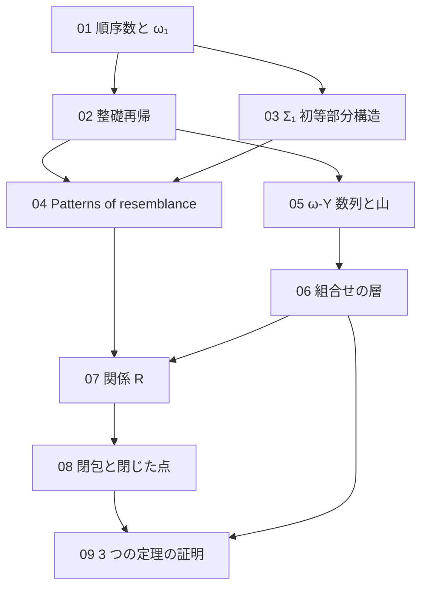

[← Back](../README.md) | [English](en/README.md) | [Japanese](README.md)

# study/

このリポジトリを読むための背景ノート。証明が既知として使う数学（順序数、整礎再帰、モデル論）と、証明の 2 つの層（Phyrion 氏の ω-Y の組合せの層と、このリポジトリの意味の層）を、定義と小さい例から書き起こす。どのノートも、Lean のコードが実際にしていることに合わせ、Lean の名前を挙げる。

姉妹プロジェクト [koteitan/1y-wo-por](https://github.com/koteitan/1y-wo-por) の [study/](https://github.com/koteitan/1y-wo-por/tree/main/study)（1-Y 版）と同じ構成である。数学が同じ部分（01〜04、08）は同じ話を、このリポジトリの定義と Lean の名前に合わせて書き直した。05、06、09 は ω-Y に特有の話である。

書き方は [rule.md](rule.md) に定める。

## 目次

| ノート | 内容 | このリポジトリでの対応箇所 |
|---|---|---|
| [01 順序数と ω₁](01-ordinals.md) | 整列順序、後者と極限、上限、可算、$`\omega_1`$ の正則性、ラベルの型 $`\{o \le \omega_1\}`$、パラメータの数え方 | README「関係 R」「3 つの定理の証明」、notes/01-design.md §3.3、[Por/Supply.lean](../Por/Supply.lean)、[OmegaY/Reflection/OrdinalSupply.lean](../OmegaY/Reflection/OrdinalSupply.lean) |
| [02 整礎関係と整礎再帰](02-well-founded.md) | `Acc`、整礎帰納法、辞書式積、鍵の辞書式順序、整礎再帰、ガードつきの再帰、ラベルの上界による停止 | README「関係 R」、notes/01-design.md §2.3、[Por/Relation.lean](../Por/Relation.lean)、[OmegaY/Keys.lean](../OmegaY/Keys.lean)、[OmegaY/Expansion/DynamicsRepresentationRank.lean](../OmegaY/Expansion/DynamicsRepresentationRank.lean) |
| [03 構造と Σ₁ 初等部分構造](03-sigma1-elementary.md) | 構造、$`\Sigma_1`$ 論理式、リテラルの連言、$`\preccurlyeq_{\Sigma_1}`$、Tarski–Vaught 判定法、Lean での論理式、部分的な上端述語 | README「関係 R」、notes/01-design.md §2.1、§2.2、[Por/Formula.lean](../Por/Formula.lean) |
| [04 Patterns of resemblance](04-patterns-of-resemblance.md) | Carlson の $`\le_1`$、小さい例、有限反映の形、bms-elem-pattern、ω-Y で足りないもの、このリポジトリの変更点 | README「証明の形」「関係 R」、notes/01-design.md §0、notes/00-survey.md §3.2〜§3.4 |
| [05 ω-Y 数列と山](05-omegay-mountain.md) | 式、$`\omega^\omega`$ 未満の行、跳び、山の作り方、展開（減一、根、marker、平行移動・輪郭・充填）、weak magma と公式の ω-Y の違い、最終定理 | README「対象」「記号」「最終定理 4 つ」、notes/00-survey.md §1.3〜§1.6、notes/02-feasibility.md §1.1、§2、[OmegaY/Rows.lean](../OmegaY/Rows.lean)、[OmegaY/Canonical/Build.lean](../OmegaY/Canonical/Build.lean)、[OmegaY/Expansion/Build.lean](../OmegaY/Expansion/Build.lean) |
| [06 Phyrion 氏の ω-Y の組合せの層](06-combinatorial-layer.md) | 鍵と型板、内部の原子と上端の原子、尺度の根と辺の鍵、表現、3 つの定理、継ぎ合わせ、予備、末尾のラベルによる降下 | README「証明の形」、notes/01-design.md §1、notes/00-survey.md §3.2、§3.5、notes/02-feasibility.md §3、§4、[OmegaY/Keys.lean](../OmegaY/Keys.lean)、[OmegaY/Reflection/Interface.lean](../OmegaY/Reflection/Interface.lean)、[OmegaY/Geometry/MountainKeys.lean](../OmegaY/Geometry/MountainKeys.lean)、[OmegaY/Splice.lean](../OmegaY/Splice.lean)、[OmegaY/Splice/](../OmegaY/Splice/)、[OmegaY/Expansion/ActualRepresentationDescent.lean](../OmegaY/Expansion/ActualRepresentationDescent.lean) |
| [07 関係 R](07-relation-r.md) | 構造 $`\mathfrak A^c_\theta`$、$`R`$ の定義、（上端、鍵）の再帰、`stepF`、`R_iff`、`R_lt`、鍵の弱化 `key_weaken` | README「関係 R」「3 つの定理の証明」、notes/01-design.md §2、§3.1、[Por/Relation.lean](../Por/Relation.lean) |
| [08 ω₁ より下の閉包と閉じた点の列](08-closure-chain.md) | Good、論理式が可算個であること、証人の高さ、`next`、`tower`、`lam`、`lam_good`、`good_cofinal`、`points` | README「3 つの定理の証明」、notes/01-design.md §3.3、[Por/Supply.lean](../Por/Supply.lean) |
| [09 3 つの定理の証明](09-obligations.md) | `finite_reflection`、`top_abs`、`good_R`、`initial_finite_graph`、薄いファイル、最終定理と公理 | README「3 つの定理の証明」「公理の監査」、notes/01-design.md §3、§4、[Por/Relation.lean](../Por/Relation.lean)、[Por/Supply.lean](../Por/Supply.lean)、[OmegaY/Reflection.lean](../OmegaY/Reflection.lean)、[OmegaY/Reflection/OrdinalSupply.lean](../OmegaY/Reflection/OrdinalSupply.lean)、[OmegaY/Model.lean](../OmegaY/Model.lean)、[OmegaY/Expansion/WellFounded.lean](../OmegaY/Expansion/WellFounded.lean) |

## 読む順

