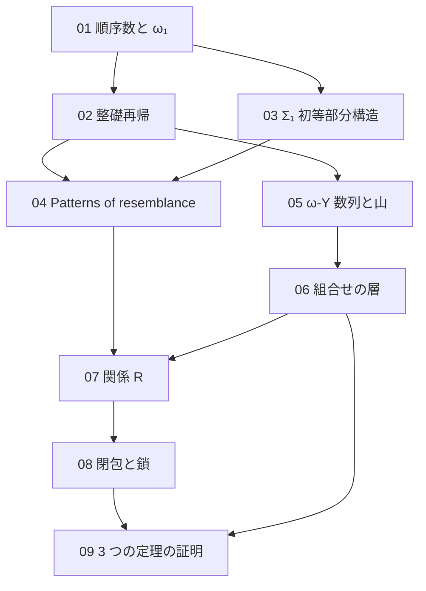

[← Back](../README.md) | [English](en/README.md) | [Japanese](README.md)

# study/

このリポジトリを読むための背景ノート。証明が既知として使う数学（順序数、整礎再帰、モデル論）と、証明の 2 つの層（Phyrion 氏の組合せの層と、このリポジトリの意味の層）を、定義と小さい例から書き起こす。

1-Y 版の [koteitan/1y-wo-por](https://github.com/koteitan/1y-wo-por) の [study/](https://github.com/koteitan/1y-wo-por/tree/main/study) と同じ構成で、同じ数学は同じ文と式で書く。05、06、09 は weak-magma ω-Y に特有の話である。

書き方は [rule.md](rule.md) に定める。

## 目次

| ノート | 内容 | このリポジトリでの対応箇所 |
|---|---|---|
| [01 順序数と ω₁](01-ordinals.md) | 整列順序、後者と極限、上限、可算、$`\omega_1`$ の正則性、ラベル $`\{o \le \omega_1\}`$、パラメータの列の数え方 | README「関係 R」「3 つの定理の証明」、notes/01-design.md §3.3 |
| [02 整礎関係と整礎再帰](02-well-founded.md) | 整礎関係、整礎帰納法、辞書式積、整礎再帰、ガードつきの再帰、ラベルの上界による停止 | README「関係 R」、notes/01-design.md §2.3 |
| [03 構造と Σ₁ 初等部分構造](03-sigma1-elementary.md) | 構造、$`\Sigma_1`$ 論理式、リテラルの連言、$`\preccurlyeq_{\Sigma_1}`$、Tarski–Vaught 判定法、$`\Sigma_1`$ 論理式の標準形、2 つの構造の比べ方、部分的な上端述語 | README「関係 R」、notes/01-design.md §2.1、§2.2 |
| [04 Patterns of resemblance](04-patterns-of-resemblance.md) | Carlson の $`\le_1`$、小さい例、停止性の証明での使い方、ω-Y で足りないもの、このリポジトリの変更点 | README「証明の形」「関係 R」、notes/01-design.md §0、notes/00-survey.md §3.2〜§3.4 |
| [05 ω-Y 数列と山](05-omegay-mountain.md) | 式、$`\omega^\omega`$ 未満の行、跳び、山、展開（1-Y と同じ分岐番号）、weak magma と公式の ω-Y、展開の例、最終定理 | README「対象」「記号」「最終定理 4 つ」、notes/00-survey.md §1.3〜§1.6、notes/02-feasibility.md §1.1、§2 |
| [06 Phyrion 氏の ω-Y の組合せの層](06-combinatorial-layer.md) | 図式、尺度の根と辺の型板、表現、上端への要求、有限反映、3 つの定理、1 ブロックの継ぎ合わせ、予備を持つ反映のくり返し、末尾のラベルによる降下 | README「証明の形」、notes/01-design.md §1、notes/00-survey.md §3.2、§3.5、notes/02-feasibility.md §3、§4 |
| [07 関係 R](07-relation-r.md) | 構造 $`\mathfrak A^c_\theta`$、$`R`$ の定義、（上端、鍵）の再帰、ガードを外す、定義から直接出る性質、鍵の弱化 | README「関係 R」「3 つの定理の証明」、notes/01-design.md §2、§3.1 |
| [08 ω₁ より下の閉包と鎖](08-closure-chain.md) | Good、論理式が可算個であること、証人の高さ、閉包の 1 ステップ、λ、λ(γ) が Good であること、鎖 | README「3 つの定理の証明」、notes/01-design.md §3.3 |
| [09 3 つの定理の証明](09-obligations.md) | 定理の一覧、有限反映、上端述語の絶対性、Good な点どうしの関係、すべての図式の表現、最終定理 | README「3 つの定理の証明」「公理の監査」、notes/01-design.md §3、§4 |

## 読む順

```mermaid
flowchart TB
  N01["01 順序数と ω₁"] --> N02["02 整礎再帰"]
  N01 --> N03["03 Σ₁ 初等部分構造"]
  N02 --> N04["04 Patterns of resemblance"]
  N03 --> N04
  N02 --> N05["05 ω-Y 数列と山"]
  N05 --> N06["06 組合せの層"]
  N04 --> N07["07 関係 R"]
  N06 --> N07
  N07 --> N08["08 閉包と鎖"]
  N08 --> N09["09 3 つの定理の証明"]
  N06 --> N09
```
