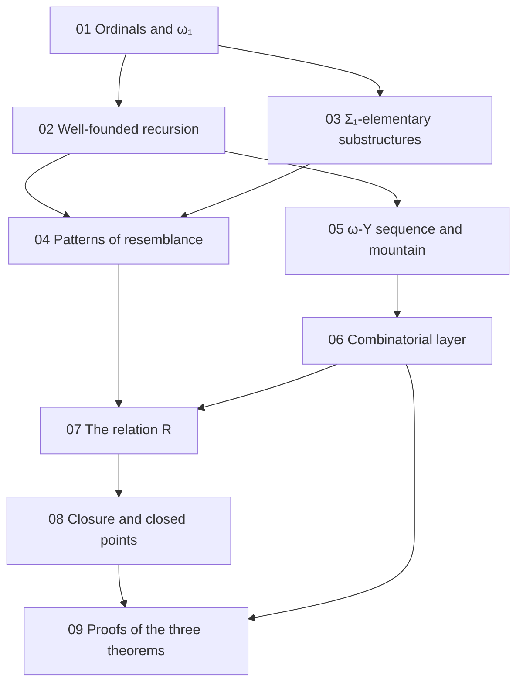

[← Back](../../README-en.md) | [English](README.md) | [Japanese](../README.md)

# study/

Background notes for reading this repository. They write out, from definitions and small examples, the mathematics the proof takes as known (ordinals, well-founded recursion, model theory) and the two layers of the proof (Phyrion's combinatorial layer for ω-Y and the semantic layer of this repository). Every note follows what the Lean code actually does and names the Lean declarations.

The structure is the same as [study/](https://github.com/koteitan/1y-wo-por/tree/main/study) (the 1-Y version) of the sister project [koteitan/1y-wo-por](https://github.com/koteitan/1y-wo-por). Where the mathematics is the same (01–04, 08), the same material is rewritten for the definitions and Lean names of this repository. Notes 05, 06 and 09 are specific to ω-Y.

The writing rules are fixed in [rule.md](rule.md).

## Contents

| Note | Topic | Where it is used in this repository |
|---|---|---|
| [01 Ordinals and ω₁](01-ordinals.md) | well-orders, successors and limits, suprema, countability, regularity of $`\omega_1`$, the label type $`\{o \le \omega_1\}`$, counting parameters | README "The relation R", "Proofs of the three theorems"; notes/01-design.md §3.3; [Por/Supply.lean](../../Por/Supply.lean), [OmegaY/Reflection/OrdinalSupply.lean](../../OmegaY/Reflection/OrdinalSupply.lean) |
| [02 Well-founded relations and recursion](02-well-founded.md) | `Acc`, well-founded induction, lexicographic products, the order of keys, well-founded recursion, guarded recursion, termination by a bound on labels | README "The relation R"; notes/01-design.md §2.3; [Por/Relation.lean](../../Por/Relation.lean), [OmegaY/Keys.lean](../../OmegaY/Keys.lean), [OmegaY/Expansion/DynamicsRepresentationRank.lean](../../OmegaY/Expansion/DynamicsRepresentationRank.lean) |
| [03 Structures and Σ₁-elementary substructures](03-sigma1-elementary.md) | structures, $`\Sigma_1`$ formulas, conjunctions of literals, $`\preccurlyeq_{\Sigma_1}`$, the Tarski–Vaught test, formulas in Lean, partial top predicates | README "The relation R"; notes/01-design.md §2.1, §2.2; [Por/Formula.lean](../../Por/Formula.lean) |
| [04 Patterns of resemblance](04-patterns-of-resemblance.md) | Carlson's $`\le_1`$, small examples, the shape of finite reflection, bms-elem-pattern, what is missing for ω-Y, the changes made here | README "Structure of the proof", "The relation R"; notes/01-design.md §0; notes/00-survey.md §3.2–§3.4 |
| [05 The ω-Y sequence and its mountain](05-omegay-mountain.md) | expressions, rows below $`\omega^\omega`$, jumps, building the mountain, expansion (decrement, root, markers, translation, contour, fill), weak magma versus the official ω-Y, the final theorems | README "Target", "Notation", "The four final theorems"; notes/00-survey.md §1.3–§1.6; notes/02-feasibility.md §1.1, §2; [OmegaY/Rows.lean](../../OmegaY/Rows.lean), [OmegaY/Canonical/Build.lean](../../OmegaY/Canonical/Build.lean), [OmegaY/Expansion/Build.lean](../../OmegaY/Expansion/Build.lean) |
| [06 Phyrion's combinatorial layer for ω-Y](06-combinatorial-layer.md) | keys and templates, internal and top atoms, scale roots and edge keys, representations, the three theorems, splicing, reservoirs, descent of the last label | README "Structure of the proof"; notes/01-design.md §1; notes/00-survey.md §3.2, §3.5; notes/02-feasibility.md §3, §4; [OmegaY/Keys.lean](../../OmegaY/Keys.lean), [OmegaY/Reflection/Interface.lean](../../OmegaY/Reflection/Interface.lean), [OmegaY/Geometry/MountainKeys.lean](../../OmegaY/Geometry/MountainKeys.lean), [OmegaY/Splice.lean](../../OmegaY/Splice.lean), [OmegaY/Splice/](../../OmegaY/Splice/), [OmegaY/Expansion/ActualRepresentationDescent.lean](../../OmegaY/Expansion/ActualRepresentationDescent.lean) |
| [07 The relation R](07-relation-r.md) | the structures $`\mathfrak A^c_\theta`$, the definition of $`R`$, the (top, key) recursion, `stepF`, `R_iff`, `R_lt`, key weakening `key_weaken` | README "The relation R", "Proofs of the three theorems"; notes/01-design.md §2, §3.1; [Por/Relation.lean](../../Por/Relation.lean) |
| [08 Closure below ω₁ and the sequence of closed points](08-closure-chain.md) | Good, countably many formulas, heights of witnesses, `next`, `tower`, `lam`, `lam_good`, `good_cofinal`, `points` | README "Proofs of the three theorems"; notes/01-design.md §3.3; [Por/Supply.lean](../../Por/Supply.lean) |
| [09 Proofs of the three theorems](09-obligations.md) | `finite_reflection`, `top_abs`, `good_R`, `initial_finite_graph`, the thin files, the final theorems and the axioms | README "Proofs of the three theorems", "Axiom audit"; notes/01-design.md §3, §4; [Por/Relation.lean](../../Por/Relation.lean), [Por/Supply.lean](../../Por/Supply.lean), [OmegaY/Reflection.lean](../../OmegaY/Reflection.lean), [OmegaY/Reflection/OrdinalSupply.lean](../../OmegaY/Reflection/OrdinalSupply.lean), [OmegaY/Model.lean](../../OmegaY/Model.lean), [OmegaY/Expansion/WellFounded.lean](../../OmegaY/Expansion/WellFounded.lean) |

The notes in `notes/` are in Japanese.

## Reading order

