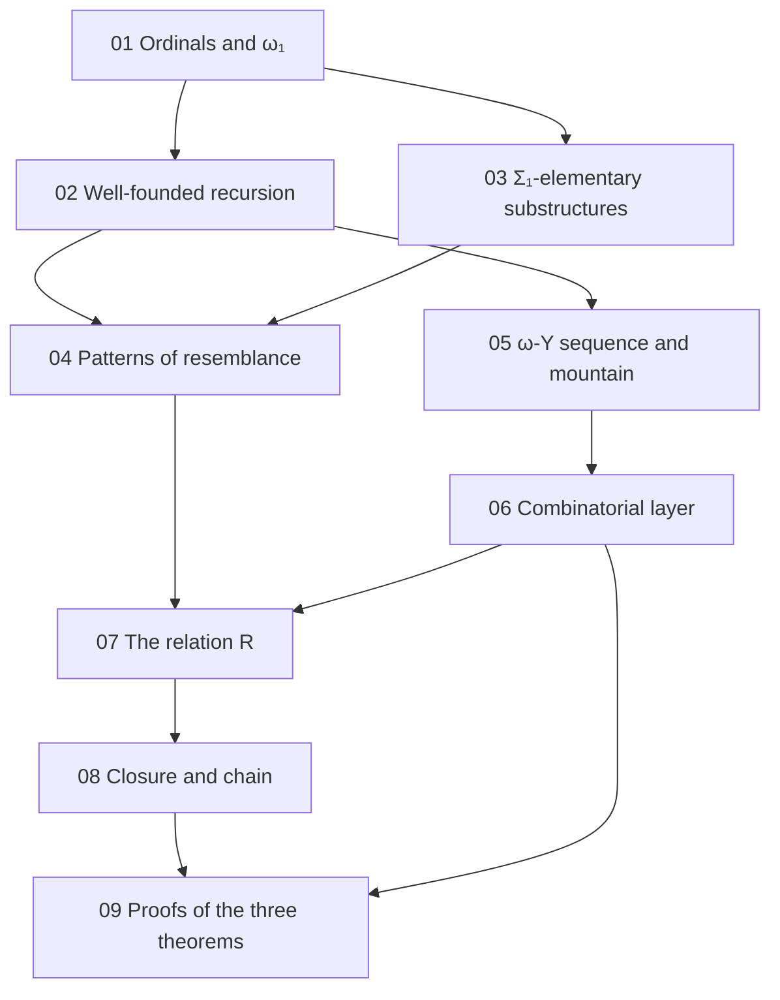

[← Back](../../README-en.md) | [English](README.md) | [Japanese](../README.md)

# study/

Background notes for reading this repository. They write out, from definitions and small examples, the mathematics the proof takes as known (ordinals, well-founded recursion, model theory) and the two layers of the proof (Phyrion's combinatorial layer and the semantic layer of this repository).

They follow the structure of [study/](https://github.com/koteitan/1y-wo-por/tree/main/study) of the 1-Y version [koteitan/1y-wo-por](https://github.com/koteitan/1y-wo-por), and the same mathematics is written with the same sentences and formulas. Notes 05, 06 and 09 are specific to weak-magma ω-Y.

The writing rules are fixed in [rule.md](rule.md).

## Contents

| Note | Topic | Where it is used in this repository |
|---|---|---|
| [01 Ordinals and ω₁](01-ordinals.md) | well-orders, successors and limits, suprema, countability, regularity of $`\omega_1`$, labels $`\{o \le \omega_1\}`$, counting parameter lists | README "The relation R", "Proofs of the three theorems"; notes/01-design.md §3.3 |
| [02 Well-founded relations and well-founded recursion](02-well-founded.md) | well-founded relations, well-founded induction, lexicographic products, well-founded recursion, guarded recursion, termination by upper bounds of labels | README "The relation R"; notes/01-design.md §2.3 |
| [03 Structures and Σ₁-elementary substructures](03-sigma1-elementary.md) | structures, $`\Sigma_1`$ formulas, conjunctions of literals, $`\preccurlyeq_{\Sigma_1}`$, the Tarski–Vaught test, the normal form of $`\Sigma_1`$ formulas, comparing two structures, partial top predicates | README "The relation R"; notes/01-design.md §2.1, §2.2 |
| [04 Patterns of resemblance](04-patterns-of-resemblance.md) | Carlson's $`\le_1`$, small examples, use in termination proofs, what is missing for ω-Y, what this repository changes | README "Structure of the proof", "The relation R"; notes/01-design.md §0; notes/00-survey.md §3.2–§3.4 |
| [05 The ω-Y sequence and its mountain](05-omegay-mountain.md) | expressions, rows below $`\omega^\omega`$, jumps, the mountain, expansion (with the branch numbers of 1-Y), weak magma and the official ω-Y, examples of expansion, the final theorems | README "Target", "Notation", "The four final theorems"; notes/00-survey.md §1.3–§1.6; notes/02-feasibility.md §1.1, §2 |
| [06 Phyrion's combinatorial layer for ω-Y](06-combinatorial-layer.md) | keys and templates, internal and top atoms, scale roots and edge keys, representations, the three theorems, splicing, reservoirs, descent of the last label | README "Structure of the proof"; notes/01-design.md §1; notes/00-survey.md §3.2, §3.5; notes/02-feasibility.md §3, §4 |
| [07 The relation R](07-relation-r.md) | the structure $`\mathfrak A^c_\theta`$, the definition of $`R`$, the (top, key) recursion, removing the guards, properties that follow directly, key weakening | README "The relation R", "Proofs of the three theorems"; notes/01-design.md §2, §3.1 |
| [08 Closure below ω₁ and the chain](08-closure-chain.md) | Good, countably many formulas, heights of witnesses, one closure step, λ, λ(γ) is Good, the chain | README "Proofs of the three theorems"; notes/01-design.md §3.3 |
| [09 Proofs of the three theorems](09-obligations.md) | finite reflection, the first representation, the final theorems and the axioms | README "Proofs of the three theorems", "Axiom audit"; notes/01-design.md §3, §4 |

The notes in `notes/` are in Japanese.

## Reading order

```mermaid
flowchart TB
  N01["01 Ordinals and ω₁"] --> N02["02 Well-founded recursion"]
  N01 --> N03["03 Σ₁-elementary substructures"]
  N02 --> N04["04 Patterns of resemblance"]
  N03 --> N04
  N02 --> N05["05 ω-Y sequence and mountain"]
  N05 --> N06["06 Combinatorial layer"]
  N04 --> N07["07 The relation R"]
  N06 --> N07
  N07 --> N08["08 Closure and chain"]
  N08 --> N09["09 Proofs of the three theorems"]
  N06 --> N09
```
